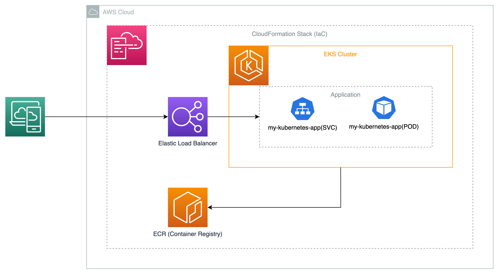

- [GITHUB](https://github.com/Kushan-Nilanga/737-2023-t1-prac7p)
- [APPLICATION](http://a5edbd71b0f3044748781b7df104b028-787418237.ap-southeast-2.elb.amazonaws.com/)

## Deployement Instructions

### Environment Variables
```bash
export STACK_NAME = kube-stack
export VPC_ID = vpc-xxx
export SUBNET_IDS = subnet-xxx,subnet-xxx,subnet-xxx
export REGION = ap-southeast-2
export ACCOUNT_ID = <your account id>
export WORKER_INSTANCE_TYPE = t3.small
```

### Kubernetes Cluster
```bash
aws cloudformation deploy --template-file ./cloudformation.yaml --stack-name $(STACK_NAME) --capabilities CAPABILITY_IAM --parameter-overrides VpcId=$(VPC_ID) SubnetIds=$(SUBNET_IDS) WorkerInstanceType=$(WORKER_INSTANCE_TYPE)
```

### Docker Build
```bash
docker build -t kube -f dockerfile . 
```

### Docker Run
```bash
docker run -p 3000:3000 kube
```

### Docker Push
```bash
aws ecr get-login-password --region $(REGION) | docker login --username AWS --password-stdin $(ACCOUNT_ID).dkr.ecr.$(REGION).amazonaws.com
docker tag kube:latest $(ACCOUNT_ID).dkr.ecr.$(REGION).amazonaws.com/$(STACK_NAME)-ecr:latest
docker push $(ACCOUNT_ID).dkr.ecr.$(REGION).amazonaws.com/$(STACK_NAME)-ecr:latest
```

### Kubernetes Deployment
```bash
kubectl apply -f ./deployment.yaml
```

### Kubernetes Service
```bash
kubectl apply -f ./service.yaml
```

## Architecture Diagram
  
